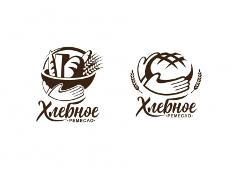

<table style="width: 100%;">
  <tr>
    <td style="text-align: center; border: none;"> 
    Минестерство образования и науки РФ  
    ГБПОУ РМЭ "Йошкар-Олинский Технологический колледж </td>
  </tr>
  <tr>
    <td style="text-align: center; border: none; height: 15em;"><h2> Курсовая работа<h2> 
    По теме: "Пекарня"
    </td>
  </tr>
  <tr>
    <td style="text-align: right; border: none; height: 20em;">
      Разработал: Игимбаев Тимур 
      Группа: И-31 
      Проверил: Колесников Е.И.       
    </td>
  </tr>
  <tr>
    <td style="text-align: center; border: none; height: 5em;">
    г.Йошкар-Ола, 2021</td>
  </tr>
</table>

# Описание предметной области

Наша компания занимается продажами хлебобулочной продукции, реализация ее продажи осуществляется с помощоью онлайн заказов. Продажа осуществляется в любых колличествах, предоставляется возможность закупки оптовой партии. Доставка осуществляется с помощью курьерской службы. Наши менеджеры могут проконсультировать наших покупателей в онлайн формате, либо же в режиме диалога по входящей линии. Кроме того менеджеры определяют цены на товары и заказы, ведут учёт заказов и создают новые акции и скидки.

Товар который мы продаём создается из высококачественных и свежих продуктов. Отдел по контролю качество строго следит за этим и ведёт учёт поставляемой продукции для создания товара по ГОСТу.
Производство продаваемого товара ведётся в цехах, которые также строго контролируются, в них проводится генеральная уборка и кварцевание перед началом работ по производсту товара и по окончанию рабочего дня. Наши пекари работают посменно и в разных цехах. По нашим пекарям нам очень важно хранить информацию о медицинском осмотре, информацию для отдела кадров и бухгалтерии, а именно ФИО, дату рождения, паспортные данные, банковские реквизиты. На каждый тип продукции у нас есть отдельная группа сотрудников, которые работают совместно. Всего у нас 4 типа продукции:
1. Пироги;
2. Пирожки;
3. Торты;
4. Хлеб; 

Также для каждого из этих видов продукции есть отдельное конткретное обуродвание, требующее наличие специализации. За каждым видом оборудования и её описанием,следят мастера производства из отдела контроля качества.
Для производства каждого вида продукции используются несколько типов сырья, нам очень важно постоянно иметь актуальную информацию об остатке сырья на складе. Информация которая важна для сырья из которого изготавливается конечный продукт:
1. Наименование;
2. Вес в одной упаковке;
3. Минимальное допустимое колличество;
4. Дата поставки сырья;
5. Дата производства сырья;

Вся история изменений количества материалов на складе, их обновление, их отсутсвтие и отпуск сырья на проивзодство фиксируется сотрудниками склада, они ведут ежедневный учёт истории сырья.

В наших цехах есть система безопасности. Войти в наш цех можно только строго по пропускам, через турникеты, также ведётся учёт прихода сотрудника в цех, фиксируется дата и время его визита, это также помогает контролировать его отработанные часы, фиксировать опаздания, либо же преждевременный уход с рабочего места. Кроме того каждый цех охраняется охарнным предприятем. А также есть возможность развоза сотрудников по домам в вечернее время, если сотрудник задержался на рабочем месте.

Так как мы можем продавать товар в неограниченных колличествах, не редко нашими заказчиками являются другие компании. Нам важно знать какой компании мы продаем товар, по этому покупающая компания должна предоставить нам инофрмацию о своём предприятии: паспорт предприятия и краткая характеристика предприятия. 
Оплатить товар можно перед получением товара, либо же после его получения. Доставка осуществляется бесплатно, есть возможность доставить товар с помощью курьерской службы самого заказчика.

Описание товара в каталоге доведено до максимальной полноты инфомарции о продукте: артикул, наименование, тип продукции, изображение, стоимость за одну штуку, дата изготовления, вес без упаковки, номер стандарта (ГОСТ). 
Если же у клиента возникнут вопросы о товаре, он всегда может обратиться по номеру горячий линии, либо же написать нашим сотрудникам прямо в онлайн формате и задать им любой вопрос, наши сотрудники ответят в течение 5 минут.

Также для новых покупателей проводятся различные скидки и акции, например если количество покупаемого товара больше 20 штук, то автоматически применится скидка 20%. Можно накапливать баллы и тратить их на покупку продукции. Информацию об акциях и скидках можно также узнать в онлайн формате. Есть система отзывов, любой клиент может написать свой отзыв о товаре, либо же о нашей компании. 
